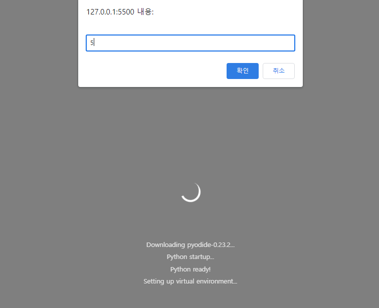
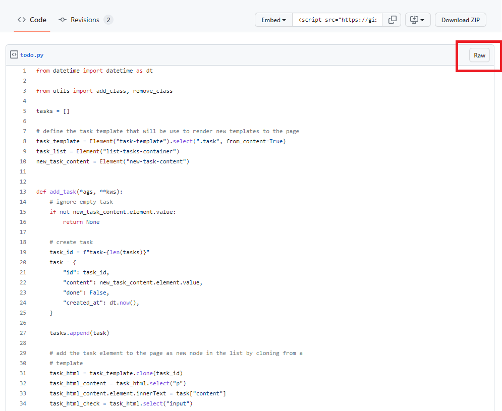
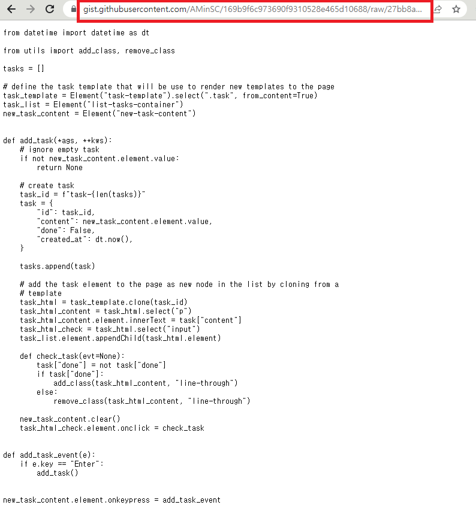

# 2.3 Py-config
HTML에서 Python의 다양한 라이브러리와 Local에서 직접 만든 모듈과 패키지, 혹은 오픈소스를 사용하려면 꼭 필요한 태그가 `<py-config>`태그 입니다.

따라서 어떻게 Python의 다양한 라이브러리와 모듈 및 패키지를 불러올 수 있는지 이번장에서 알아보겠습니다.


## 2.3.1 py-config란?
`<py-config>` 태그는 쉽게 말해서, 내가 사용하고자 하는 Python 라이브러리 및 모듈, 패키지, 오픈소스를 설정하고 구성하는 곳입니다.

- 구성은 `TOML`형식과 `JSON` 형식이 있으며, 기본(Default)값은 `TOML`형식입니다.

- TOML 형식
    ```html
    <!-- 1 -->
    <py-config src="./custom.toml"></py-config>
    
    <!-- 2 -->
    <py-config>
    [[fetch]]
    files = ["./utils.py"]
    </py-config>
    ```

- JSON 형식
    ```html
    <!-- 1 -->
    <py-config type="json" src="./custom.json"></py-config>

    <!-- 2 -->
    <py-config>
    {
        "fetch": [{
        "files": ["./utils.py"]
        }]
    }
    </py-config>
    ```
    
1. src에 경로(`./custom.toml`)를 설정하거나,
2. `<py-config>`태그 안에 직접 작성할 수 있습니다. 


- 참고: `<py-config>` 태그는 `TOML`과 `JSON`을 모두 지원하지만, 서로 다른 두 소스에서 전달된 구성 유형을 혼합할 수 없습니다. 즉, 인라인 구성은 `TOML` 형식이고 src의 구성은 `JSON` 형식인 경우는 허용되지 않습니다. 반대의 경우도 마찬가지입니다.

- `<py-config>` 요소는 `<body>` 요소 안에 배치하는 것을 권고합니다.

- 앞으로 예시 코드는 `TOML`형식으로 작성하겠습니다.


## 2.3.2 Package
이제 본격적으로 `Python` 라이브러리를 구성하는법을 알아보겠습니다.

우선 `<body>`태그 블럭 안에 `<py-config>`태그를 작성합니다.
작성한 `<py-config>`태그 블럭 안에 구성하고싶은 라이브러리를 `package`라는 값에 리스트 형식으로 넣어줍니다. 이때, 넣고자 하는 패키지는 문자열로 큰따옴표(")로 감싸줍니다. (작은따옴표(')도 사용 가능합니다.)


```html
<body>
    <py-config>
        package = ["random"]
    </py-config>

    <py-script>
        import random

        display(f'random (1 ~ 10) : {random.randint(1, 10)}')
    </py-script>
</body>
```

이후에 `<py-script>`태그 블럭안에서 위에서 구성한 라이브러리를 `import`한 뒤에 사용할 수 있습니다.


그 외에도 `Data Analysis`, `Machine Learning`, `Deep Learning`에서 주로 사용하는 `pandas`, `mabplotlib` 등 다양한 라이브러리를 구성하고 사용할 수 있습니다.

## 2.3.3. Local Module 사용법과 예시 코드
만약, 사용하고자 하는 기능을 `Python`으로 이전에 만들었거나, 만들면 좋을 것 같은 기능들을 `HTML`에서 사용하는 법을 알아보겠습니다.

알아보기에 앞서, `func.py`파일 내용이 아래와 같다고 가정하겠습니다.
```py
import random


class Calculator:
    def __init__(self):
        pass

    def add(self, a, b):
        return a + b

    def sub(self, a, b):
        return a - b

    def mul(self, a, b):
        return a * b

    def div(self, a, b):
        if b == 0:
            return "Error: Division by zero is not allowed"
        else:
            return a / b


def lotto_number_generator(game: int):
    paper = []
    for _ in range(game):
        lotto_numbers = random.sample(range(1, 46), 6)
        paper.append(lotto_numbers)
    
    for i, v in enumerate(paper):
        paper[i] = sorted(v)
        print(paper[i])
```
`class`는 간단한 계산기를 구현했으며, `fucntion`의 경우 랜덤한 수 6개를 사용자가 원하는 갯수만큼 반환해주는 기능을 구현했습니다. 
<!-- class와 function 수정 예정 -->

이제 두 기능을 `<py-config>`태그를 활용해서 같은 경로에 있는`HTML`파일에서 사용하는 법을 알아보겠습니다.

```html
<!-- 생략 -->
<body>
    <py-config>
        [[fetch]]
        from = '.'
        files = ["func.py"]
    </py-config>
    <py-script>
        from func import Calculator
        from func import lotto_number_generator


        cal = Calculator()
        display(f'더하기 : {cal.add(4, 2)}')
        display(f'빼기 : {cal.sub(4, 2)}')
        display(f'곱하기 : {cal.mul(4, 2)}')
        display(f'나누기 : {cal.div(4, 2)}')
        
        select_num = int(input())
        games = lotto_number_generator(select_num)
        display(f'원하시는 {select_num} 게임의 로또 번호입니다. {games}')
    </py-script>
</body>
</html>
```

`<py-config>`태그 안에는 우선 `[[fetch]]`를 통해서 `from`은 파일 경로, `files`는 파일 이름을 적어줍니다.
여기서 파일 이름은 확장자까지 적어줘야 합니다.

VSCode의 `Go Live`를 통해 실행해보면 아래와 같습니다.

우선 `input`값을 받고,



결괏값을 확인할 수 있습니다.

<!-- /class와 function 수정 예정 -->


## 2.3.4 추가 사용법과 예시 코드
### gist 사용법
만약, 사용하고자 하는 코드가 로컬에 있는것이 아니라, GitHub gist에 있다고 가정한다면, 보통 이를 사용하기 위해선 가까운 경로에 파일을 새로 생성하여 코드를 작성하고 저장하여 호출할 것입니다.

하지만, 위 방법은 번거로울 수 있기 때문에, 직접 gist주소를 전달하여 호출하는 방법을 알아보겠습니다.

방법은 간단 합니다.

먼저 사용하고자 하는 `Python`코드가 있는 `gist`페이지에 접속합니다.

그 다음 빨간 박스에 있는 `Raw`를 누르면 아래와 같은 상태가 됩니다.

그럼 빨간 박스에 해당하는 url을 복사해서 `<py-config>`의 `from`에서 경로 설정을 해주면 되는데, 여기서 마지막 파일 이름은 제외시키고 파일 이름은 `files`에 적어 줍니다.

```html
<py-config>
    [[fetch]]
    from = "https://gist.githubusercontent.com/AMinSC/169b9f6c973690f9310528e465d10688/raw/27bb8acea57d407789b0940f8b127db9b9a837a4/"
    files = ["todo.py"]
</py-config>
```
그러고 나서 아래와 같이 사용하면 됩니다.
```html
<!-- index.html -->
 <py-script>
    from todo import add_task, dd_task_event
</py-script>
```
- from `<.py 파일 이름>` import `<.py파일에서 사용하고 싶은 함수 이름>`

### `<py-config>`에서 지원하는 value값
`<py-config>`태그에서는 위에서 사용했던 `fetch` 부터 다양한 value값을 지원합니다.

| Value  | Type | Description |
| ------------- | ------------- | ------------- |
| `version`  | string  | 사용자 애플리케이션의 버전입니다. PyScript버전과는 관련이 없습니다.  |
| `fetch`  | List of Stuff to fetch  | 로컬 Python 모듈 또는 인터넷의 리소스를 지정하여 호출할 수 있습니다.  |
| `plugins`  | List of Plugins  | 플러그인 목록을 여기에 지정합니다.  |
| `packages`  | List of packages  | 오픈 소스코드를 불러올 수 있습니다.  |

이 외에도 다양한 value 값들을 확인하고 싶으신 분들은 `https://docs.pyscript.net/latest/reference/elements/py-config.html#supported-configuration-values`에서 확인 가능합니다.

### `fetch` 구성
`fetch`구성은 아래와 같으며,  위에서 사용했었던 `from`과 `file`외에도 `to_folder`와 `to_file`이 있습니다.

| Value  | Type | Description |
| ------------- | ------------- | ------------- |
| `from`  | string  | 가져올 리소스의 기본 URL입니다.  |
| `files`  | List of strings  | 다운로드할 파일 목록입니다.  |
| `to_folder`  | string  | 파일 시스템에 생성할 폴더의 이름입니다.  |
| `to_file`  | string  | 파일 시스템에 생성할 대상의 이름입니다.  |

-  `to_file`과 `files`은 함께 사용할 수 없습니다.

부가설명을 위해 폴더트리 예시와 info.txt파일 예시는 아래와 같습니다.

- 폴더트리
    ```
    content/
    ├─ index.html <<< File with <py-config>
    ├─ info.txt
    ├─ data/
    │  ├─ sensordata.csv
    ├─ packages/
    │  ├─ my_package/
    │  │  ├─ __init__.py
    │  │  ├─ helloworld/
    │  │  │  ├─ __init__.py
    │  │  │  ├─ greetings.py
    ```

- info.txt
    ```txt
    This is PyScript
    ```

1. 단일 파일 가져오기
    ```html
    <body>
        <py-config>
            [[fetch]]
            files = ['info.txt']
        </py-config>
        <py-script>
            with open('info.txt', 'r') as fp:
                print(fp.read())
        </py-script>
    </body>
    ```

    

2. 가져온 단일 파일을 이름을 변경하여 사용
    ```html
    <py-config>
        [[fetch]]
        from = 'info.txt'
        to_file = 'info_loaded_from_web.txt'
    </py-config>
    <py-script>
        with open('info_loaded_from_web.txt', 'r') as fp:
            print(fp.read())
    </py-script>
    ```
    불러오는 파일 이름을 작업공간에서 임시로 `to_file`로 변경하여 사용하는 법입니다.

3. 가져온 파일을 다른 폴더로 이동
    ```html
    <body>
        <py-config>
            [[fetch]]
            files = ['info.txt']
            to_folder = 'infofiles/loaded_info'
        </py-config>
        <py-script>
            with open('infofiles/loaded_info/info.txt', 'r') as fp:
                print(fp.read())
        </py-script>
    </body>
    ```
    불러온 파일의 경로를 `to_folder`로 임의의 위치로 변경하여 사용하는 법입니다.

4. 가져온 파일의 이름을 변경하여 다른 폴더로 이동
    ```html
    <body>
        <py-config>
            [[fetch]]
            from = 'info.txt'
            to_folder = 'infofiles/loaded_info'
            to_file = 'info_loaded_from_web.txt'
        </py-config>
        <py-script>
            with open('infofiles/loaded_info/info_loaded_from_web.txt', 'r') as fp:
                print(fp.read())
        </py-script>
    </body>
    ```
    2번과 3번을 혼합하여, `to_forder`로 경로를 지정하고 `to_file`로 파일 이름을 변경합니다.

5. 다른 경로의 작업파일을 현재 작업경로 위치로 변경
    ```html
    <body>
        <py-config>
            [[fetch]]
            from = 'data/'
            files = ['sensordata.csv']
        </py-config>
        <py-script>
            with open('./sensordata.csv', 'r') as fp:
            print(fp.read())
        </py-script>
    </body>
    ```
    `from`으로 가져오고자 하는 위치에 경로를 지정해주면, 파일을 불러올 때 해당 경로를 작성하지 않고 현재 작업 위치로('./') 변경하여 사용할 수 있습니다.

6. 기존 경로의 작업파일을 다른 경로로 설정하여 작업할 경우
    ```html
    <body>
        <py-config>
            [[fetch]]
            from = 'data/'
            to_folder = './local_data'
            files = ['sensordata.csv']
        </py-config>
        <py-script>
            with open('./local_data/sensordata.csv', 'r') as fp:
            print(fp.read())
        </py-script>
    </body>
    ```
    파일의 경로만 `to_folder`를 사용하여 변경한뒤에 사용할 수 있습니다.

7. 패키지 구조 혹은 폴더 트리를 보존하여 불러올 경우
    ```html
    <body>
        <py-config>
            [[fetch]]
            from = 'packages/my_package/'
            files = ['__init__.py', 'helloworld/greetings.py', 'helloworld/__init__.py']
            to_folder = 'custom_pkg'
        </py-config>
        <py-script>
            from custom_pkg.helloworld.greetings import say_hi
            print(say_hi())
        </py-script>
    </body>
    ```
    위 예시는 기존에 'packages/my_package/' 경로를 `to_folder`로 변경해준 뒤에 `files`로 my_package와 하위 디렉토리인 helloworld 패키지를 보존하여 불러오는 방법입니다.

8. 파일 이름으로 끝나지 않는 API의 경우
    ```html
    <body>
        <py-config>
            [[fetch]]
            from = 'https://catfact.ninja/fact'
            to_file = './cat_fact.json'
        </py-config>
        <py-script>
            import json
            with open("cat_fact.json", "r") as fp:
                data = json.load(fp)
                display(data)
        </py-script>
    </body>
    ```
    만약, 사용하고자 하는 API의 확장자가 파일이 아닐 경우, `to_file`로 확장자를 설정하여 사용할 수 있습니다.


### Interpreter
Pyscript는 웹 브라우저에서 실행되기 때문에 webassembly기술인 pyodide로 인터프리터합니다.

| Value  | Type | Description |
| ------------- | ------------- | ------------- |
| `src`  | string (Required)  | 인터프리터 소스에 대한 URL을 입력합니다.  |
| `name`  | string  | interpreter의 이름입니다. 개발자가 자신의 필요에 맞는 방식으로 활용할 수 있 있습니다.  |
| `lang`  | string  | interpreter가 지원하는 프로그래밍 언어입니다. 현재 PyScript의 동작 방식에는 영향을 미치지 않습니다.  |


기본 `Interpreter`는 아래와 같이 지정할 수 있으며, 다른 버전인 `pyodide`입니다.

```html
<py-config>
  [[interpreters]]
  src = "https://cdn.jsdelivr.net/pyodide/v0.20.0/full/pyodide.js"
  name = "pyodide-0.20.0"
  lang = "python"
</py-config>
```

- 현재 `PyScript`는 단일 인터프리터를 지원하지만 향후 변경될 수 있습니다.

