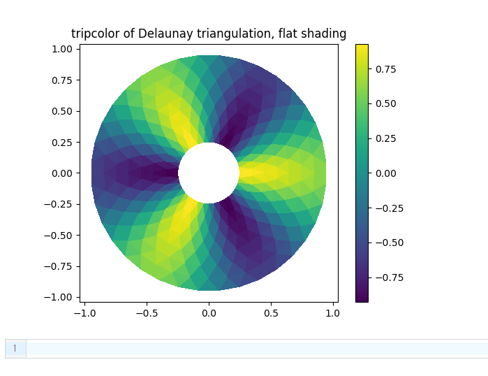
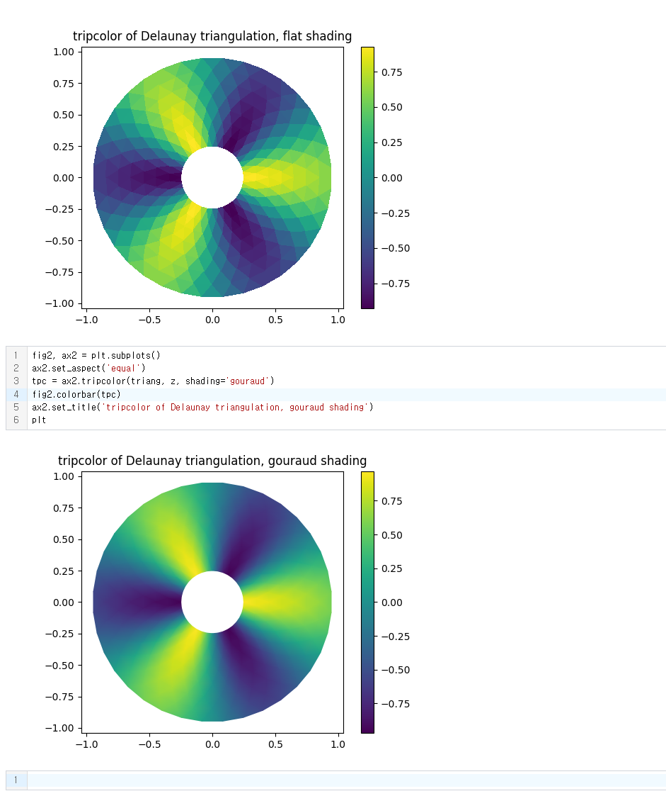
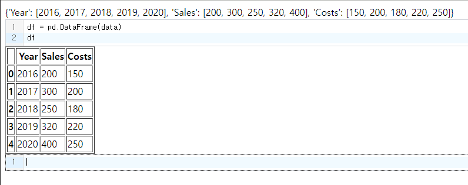

# 3.4 시각화 (데이터 분석) + py-repl로 데이터 처리가능
이번 장에서는 `<py-config>`태그로 Python Package를 구성하여 간단하게 시각화를 해보겠습니다.

## 3.4.1 matplotlib
Python에서 시각화 라이브러리로 matplotlib이 있습니다.
matplotlib 공식 사이트에서 몇가지 샘플로 시각화를 해보겠습니다.

### 간단한 예
우선 라이브러리를 모두 불러오겠습니다.
```html
<py-config>
    package = ["matplotlib", "numpy"]
</py-config>
```

그 다음 시각화를 하기에 앞서 `<py-script>`태그에 직접 작성하는 방법과 `<py-repl>`태그로 jupyter 환경처럼 작성하는 방법 2가지를 알아보겠습니다.

우선, `<py-config>`태그에 직접 작성하는 방법입니다.
```html
<script type="py">
    import matplotlib as mpl
    import matplotlib.pyplot as plt
    import numpy as np

    
    fig, ax = plt.subplots()  # Create a figure containing a single axes.
    ax.plot([1, 2, 3, 4], [1, 4, 2, 3])  # Plot some data on the axes.

    display(plt, target="out")
</script>
<div id="out"></div>
```
여기서 display함수의 target파라미터값으로 원하는 태그값의 id를 설정해주면 해당 태그의 자식노드에 div태그가 생성되고 div태그의 자식노드에서 img태그를 통해 화면에 표시가 되며, 파라미터를 작성하지 않을경우 py-script태그의 자식노드에 동일하게 생성되어 화면에서 확인할 수 있습니다. 


이번엔 `<py-repl>`태그를 활용해보겠습니다.
```html
<body>
    <py-config>
        packages = ["matplotlib", "numpy"]
    </py-config>
    <py-repl auto-generate="true"> </py-repl>
</body>
```

이제 아래의 코드를 작성하고 실행해봅니다.
```python
import matplotlib as mpl
import matplotlib.pyplot as plt
import numpy as np


fig, ax = plt.subplots()  # Create a figure containing a single axes.
ax.plot([1, 2, 3, 4], [1, 4, 2, 3])  # Plot some data on the axes.

plt
```


이 장에서는 matplotlib 라이브러리를 깊게 배우기보단, PyScript에서 Python 라이브러리를 응용하여 시각화를 할 수 있음에 초점을 두겠습니다.

matplotlib 라이브러리에 관심이 있으시다면, 공식 홈페이지 가이드를 참고 부탁드리겠습니다.
https://matplotlib.org/stable/tutorials/introductory/quick_start.html#sphx-glr-tutorials-introductory-quick-start-py

### Lines, bars and markers(선, 막대 및 마커)
1. Bar Color
    ```html
    <body>
        <py-config>
            packages = ["matplotlib"]
        </py-config>

        <script type="py">
            import matplotlib.pyplot as plt

            fig, ax = plt.subplots()

            fruits = ['apple', 'blueberry', 'cherry', 'orange']
            counts = [40, 100, 30, 55]
            bar_labels = ['red', 'blue', 'red', 'orange']
            bar_colors = ['tab:red', 'tab:blue', 'tab:red', 'tab:orange']

            ax.bar(fruits, counts, label=bar_labels, color=bar_colors)

            ax.set_ylabel('fruit supply')
            ax.set_title('Fruit supply by kind and color')
            ax.legend(title='Fruit color')

            display(plt, target="bar")
        </script>

        <div id="bar"></div>
    </body>
    ```

    


2. Grouped bar chart with labels
    ```html
    <body>
        <py-config>
            packages = ["matplotlib"]
        </py-config>

        <script type="py">
            # data from https://allisonhorst.github.io/palmerpenguins/

            import matplotlib.pyplot as plt
            import numpy as np

            species = ("Adelie", "Chinstrap", "Gentoo")
            penguin_means = {
                'Bill Depth': (18.35, 18.43, 14.98),
                'Bill Length': (38.79, 48.83, 47.50),
                'Flipper Length': (189.95, 195.82, 217.19),
            }

            x = np.arange(len(species))  # the label locations
            width = 0.25  # the width of the bars
            multiplier = 0

            fig, ax = plt.subplots(layout='constrained')

            for attribute, measurement in penguin_means.items():
                offset = width * multiplier
                rects = ax.bar(x + offset, measurement, width, label=attribute)
                ax.bar_label(rects, padding=3)
                multiplier += 1

            # Add some text for labels, title and custom x-axis tick labels, etc.
            ax.set_ylabel('Length (mm)')
            ax.set_title('Penguin attributes by species')
            ax.set_xticks(x + width, species)
            ax.legend(loc='upper left')
            ax.set_ylim(0, 250)

            display(plt, target="graph-bar")
        </script>

        <div id="graph-bar"></div>
    </body>
    ```

    


### Images, contours and fields

1. Pseudocolor plots of unstructured triangular grids.

    ```html
    <body>
        <py-config>
            packages = ["matplotlib"]
        </py-config>

        <script type="py">
            import matplotlib.pyplot as plt
            import matplotlib.tri as tri
            import numpy as np

            
            # First create the x and y coordinates of the points.
            n_angles = 36
            n_radii = 8
            min_radius = 0.25
            radii = np.linspace(min_radius, 0.95, n_radii)

            angles = np.linspace(0, 2 * np.pi, n_angles, endpoint=False)
            angles = np.repeat(angles[..., np.newaxis], n_radii, axis=1)
            angles[:, 1::2] += np.pi / n_angles

            x = (radii * np.cos(angles)).flatten()
            y = (radii * np.sin(angles)).flatten()
            z = (np.cos(radii) * np.cos(3 * angles)).flatten()

            # Create the Triangulation; no triangles so Delaunay triangulation created.
            triang = tri.Triangulation(x, y)

            # Mask off unwanted triangles.
            triang.set_mask(np.hypot(x[triang.triangles].mean(axis=1),
                                    y[triang.triangles].mean(axis=1))
                            < min_radius)


            fig1, ax1 = plt.subplots()
            ax1.set_aspect('equal')
            tpc = ax1.tripcolor(triang, z, shading='flat')
            fig1.colorbar(tpc)
            ax1.set_title('tripcolor of Delaunay triangulation, flat shading')

            display(plt, target="Triangulation")
        </script>

        <div id="Triangulation"></div>
    </body>
    ```

    


2. Illustrate Gouraud shading.

    ```python
    fig2, ax2 = plt.subplots()
    ax2.set_aspect('equal')
    tpc = ax2.tripcolor(triang, z, shading='gouraud')
    fig2.colorbar(tpc)
    ax2.set_title('tripcolor of Delaunay triangulation, gouraud shading')
    plt
    ```

    


외에도 정말 다양한 시각화 샘플 코드가 있습니다.
관심 있으시다면 공식 사이트 방문을 권장드립니다.
`https://matplotlib.org/stable/gallery/index.html`

## 3.4.2 pandas
데이터 분석에 용이한 DataFrame을 사용할 수 있는 라이브러리인 pandas가 있습니다. 
보통 json, csv파일을 load 하여 사용하지만 이번 장에서는 다른 data를 사용하지 않고 임의에 데이터로 실습해 보겠습니다.


### 간단한 예
pandas는 데이터분석 라이브러리로 주로 jupyter notebook이나 colab으로 합니다.
우리는 pyscript의 `<py-config>`태그를 활용하겠습니다.

1. 활용하기에 앞서 기본 Dict형 데이터 틀과 함께 html파일을 아래와 같이 작성한 뒤에 Go Live하여 진행하겠습니다.
    ```html
    <body>
        <py-config>
            packages = ["pandas", "matplotlib"]
        </py-config>

        <script type="py">
            import pandas as pd
            import matplotlib.pyplot as plt

            # Creating a DataFrame
            data = {'Year': [2016, 2017, 2018, 2019, 2020],
                    'Sales': [200, 300, 250, 320, 400],
                    'Costs': [150, 200, 180, 220, 250]}

            # df = pd.DataFrame(data)

            display(data, target="out")
        </script>

        <div id="out"></div>
        <py-repl auto-generate="true"> </py-repl>
    </body>
    ```

    


2. Dict형 데이터를 pandas를 활용하여 DataFrame으로 변환해줍니다.
    ```python
    df = pd.DataFrame(data)
    df
    ```

    


3. 위에서 시각화 해주기 위해 사용하였던 라이브러리인 matplotlib을 사용하여 DataFrame형 데이터를 시각화 합니다.
    ```python
    # Plotting the data
    plt.figure(figsize=(10, 5))

    # Plotting Sales data
    plt.plot(df['Year'], df['Sales'], label='Sales', color='blue', marker='o')

    # Plotting Costs data
    plt.plot(df['Year'], df['Costs'], label='Costs', color='red', marker='o')

    # Adding labels and title
    plt.xlabel('Year')
    plt.ylabel('Amount in USD')
    plt.title('Yearly Sales and Costs')
    plt.legend()

    plt
    ```

    

- 먼저 필요한 라이브러리인 pandas 및 matplotlib.pyplot을 가져옵니다.

- key가 column name이고 value가 data 목록인 Dict를 사용하여 DataFrame을 만들었습니다.

- matplotlib.pyplot을 사용하여 'Year' col 위에 'Sales' 및 'Costs' col의 선 도표를 만들었습니다.

- label, title, legend(범례)를 추가하여 플롯을 보다 유익하게 만들었습니다.

- 마지막으로 plt.show()를 사용하여 플롯을 표시하지만, `py-repl`에서는 plt로 표시했습니다.


### Table Visualization
```html
<body>
    <py-config>
        packages = ["pandas", "numpy", "matplotlib", "Jinja2"]
    </py-config>

    <script type="py">
        import pandas as pd
        import numpy as np
        import matplotlib as mpl
        
        df = pd.DataFrame({
            "strings": ["Adam", "Mike"],
            "ints": [1, 3],
            "floats": [1.123, 1000.23]
        })
        data = df.style \
        .format(precision=3, thousands=".", decimal=",") \
        .format_index(str.upper, axis=1) \
        .relabel_index(["row 1", "row 2"], axis=0)
        display(data, target="out")
    </script>

    <div id="out"></div>
    <py-repl auto-generate="true"> </py-repl>
</body>
```

- Jinja2란?
    Jinja2는 Data와 Template를 결합하여 Documents를 렌더링 해주는 Python용 템플릿 엔진 입니다.


```python
weather_df = pd.DataFrame(np.random.rand(10,2)*5,
                          index=pd.date_range(start="2021-01-01", periods=10),
                          columns=["Tokyo", "Beijing"])

def rain_condition(v):
    if v < 1.75:
        return "Dry"
    elif v < 2.75:
        return "Rain"
    return "Heavy Rain"

def make_pretty(styler):
    styler.set_caption("Weather Conditions")
    styler.format(rain_condition)
    styler.format_index(lambda v: v.strftime("%A"))
    styler.background_gradient(axis=None, vmin=1, vmax=5, cmap="YlGnBu")
    return styler

weather_df
```


```python
weather_df.loc["2021-01-04":"2021-01-08"].style.pipe(make_pretty)
```


## 3.4.3 sklearn (보류) or 데이터를 읽어와서 사용

- repl 옵션 확인하기
- https://scikit-learn.org/stable/auto_examples/ensemble/plot_stack_predictors.html#measure-and-plot-the-results
